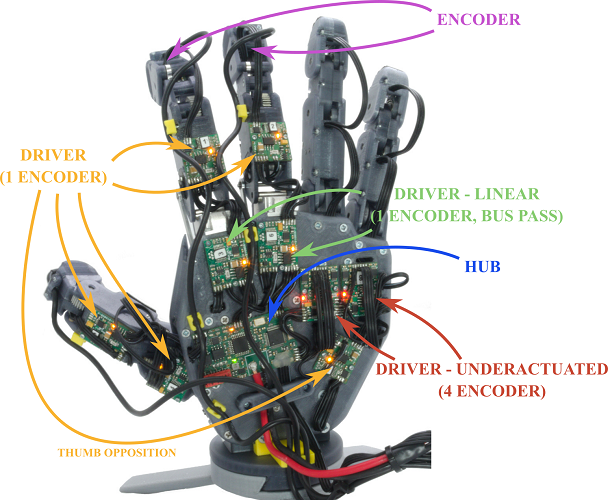

# PUT-Hand-PCB

## About

PUT-Hand is an open-source project of a 5-finger anhomomorphic gripper. PUT-Hand is designed to manipulate wide range of object including elastic objects. PUT-Hand was designed using as many off-the-shelf parts and FDM 3D printing technology, with single elements requiring aluminium CNC machining or stainless steel turning. The [PUT-Hand repositories](https://github.com/puthand) include all parts necessary to recreate the proposed design: mechanical files, PCB design and firmware.

PUT-Hand-PCB repository contains schematics and gerber files if PUT-Hand printed circuit boards. The repository contains design files of HUB (a main integration unit), ENCODERS (fixing PCBs used in fully actuated finger design to hold resistive position sensor) and 3 variants of DRIVER units (execution and measurement servomechanism circuits).



## License

<a rel="license" href="http://creativecommons.org/licenses/by-nc/4.0/"></a>

Unless stated otherwise, PUT-Hand project elements are licensed under a [Creative Commons Attribution-NonCommercial 4.0 International](https://creativecommons.org/licenses/by-nc/4.0/) (CC BY-NC 4.0). Accompanying firmware and software are licensed under a [MIT License](https://opensource.org/licenses/MIT).

When using PUT-Hand design files, firmware, software, or utilising project as a whole please cite:

```plaintext
TBD
```
